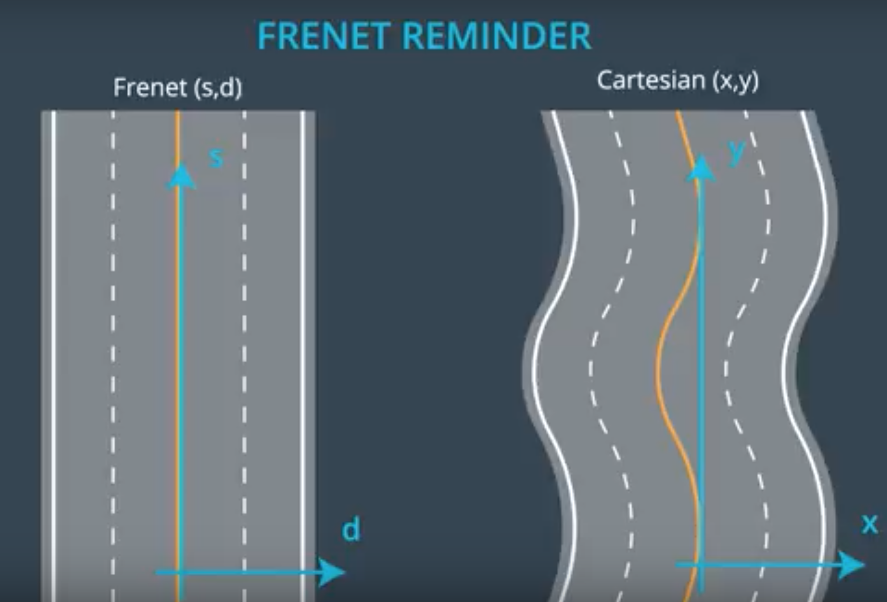

## Code Explanation

This project is divided into 3 modules Behavior, Prediction and Trajectory Generation. 
The project also contains a `main.cpp` which gets inputs from the simulator and passes a list
of points namely `next_x_vals` and `next_y_vals` which are the next positions of the car in the 
simulator environment. 

Following is the explanation of the different modules of code along with main.cpp

### main.cpp
`main.cpp` is the driver file of this project which gets data from simulator including
- Map of simulator with `x, y, s, dx, dy` points along the path.
- Current location of car - It is represented as following
	```double car_x = j[1]["x"];
       double car_y = j[1]["y"];
       double car_s = j[1]["s"];
       double car_d = j[1]["d"];
       double car_yaw = j[1]["yaw"];
       double car_speed = j[1]["speed"];```
- Previous path given to simulator.
    ```//Previous path data given to the Planner
       auto previous_path_x = j[1]["previous_path_x"];
       auto previous_path_y = j[1]["previous_path_y"];
       // Previous path's end s and d values 
       double end_path_s = j[1]["end_path_s"];
       double end_path_d = j[1]["end_path_d"];```
- Sensor fusion data of the car. This is helpful in understanding the positions and velocities of other 
vehicles on the road. We store data from sensor fusion in an Object of class `Road`. All vehicles are stores 
in a map named `vehicles`. The implementation of this is shown in method `updateRoad` in `main.cpp` from lines
`194` to `224`. 
- In `updateRoad` method I have made sure to only include vehicles on the right side of the road, so that we dont have to
deal with data from vehicles on the other side. This is done by following
```    
//  Add only lanes on right side
       if (lane >=0 && lane <=2) {
       ...
       }
```
- Lane is calculated by dividing the `d` information from sensorFusion data by 4 as each lane is 4m wide and `d` representes 
the absolute position of lateral displacement of car from center line in Frenet Coordinates.
```C++
 for (auto& element : fusion) {
    int lane = element[6].get<double>()/4;
```
- Simulator sends messages to `main.cpp` with the above mentioned information every 20ms. `main.cpp` then
processes this information and send the data to <b>Behavior Module</b> for getting the `next_x_vals` and 
`next_y_vals` to be send to the simulator.

### Car State
Car state is a vector of the current position and velocity of the car which is constructed in `main.cpp` and 
used throughout the other modules so this is a good place to explain this vector before we dive into the other 
modules.
Car is constructed in line `123` of `main.cpp` as following
```C++
vector<double> car_state = {car_x, car_y, car_s, car_d, car_yaw, car_speed, car_d/4};
```
Above car_x and car_y and x,y coordinates of the current location of the car. car_s is the longitudinal 
displacement of car from starting point and car_d is the lateral displacement of car from center line in 
Frenet Coordinates. A visual comparison of transformation between Frenet and xy coordinates is given below.
Frenet coordinates are easir to work with as the road curves dont have to be taken into consideration and
they make the calculations easier.



car_s is the speed of the car and the last entry car_d/4 is representative of the current lane of the car. We 
are storing all this information in one place so that we dont have to construct it again and again and pass it 
through multiple method arguments.


### Behavior Module
This module receives data first from `main.cpp` and is the master module for all other modules. The implementation of
behavior module is in the file named `Behavior.cpp`.
- The `planRoute` method in `Behavior.cpp` receives Road data (speed limit, path points, other vehicles information),
[car_state](#carstate), previous path points.
- This data is used to determine the next_lane and next_velocity of the car and is passed to the 
[Trajectory Generation Module](#trajectorygenerationmodule) to generate list of x,y points
- Various factors come into play when determing the next_lane and next_velocity of the car. We need to check if going in
 a particular lane and velocity might cause collisions with other vehicles. Also we need to check if the next-lane represents
 a change of lane from current lane then is it feasible to do so. Behavior module uses Prediction Module to determine 
 potential collisions with other vehicles and a state machine to check feasibility of manouvers.
- The code to determine `next_lane` is in method `next_lane` of `Behavior.cpp` in lines `54-71`. It first check if it is 
safe to continue in same lane, if it is it continues to do so. If not it checks if it is possible to move to any other lanes
without causing collisions. If there are collisions in all lanes it sets a flag indicating the same causing the vehicle to
stay in the current lane and lower its velocity to avoid collisions.
- Also we dont want to change more than 1 lane at a time -hence if the target lane is more than 1 ane away from current lane 
we continue to stay in the same lane.
- To determine the `next_velocity` method named `next_velocity` lines `83-92` in `Behavior.cpp` is used. This method checks
if the flag to say `all_collisions` is set and if it is it lowers the speed. Also it was noticed during testing that speed
needs to be reduced during lane changes so  this method lowers speed if the car is about to change lanes. If none of the 
above is true and car is going at a speed less than the speed limit of the road the next_velocity is increases.
- The increase and decrease in velocity of car is gradual with intervals of `0.224`. This is so that car does not provide a 
bumpy ride for its passengers.
- Additionally it was found that just like real life it is difficult to change lanes on high curving road stretches, so this 
has been checked in `behavior.cpp` by calculating the `road_curve` from the `dx, dy` values of the `NextWayPoint`. 
Code for this is lines `24 - 32`.


### Prediction Module
Implementation of this module in `Prediction.cpp`. 
- This module has a single method named `will_collide` which takes as arguments `lane` and `car_state` and checks based 
on the car_state and other vehicles in that lane if a coliision is imminent.
- The conditions of this check are in line `33` of `Prediction.cpp`.
- Along with checking with vehciles ahead of us are atleast a distance 30m from us, this method also makes sures that there
is a buffer of 6m at both front and back of us otherwise a fast moving vehicle can hit our car from behind when changing lanes.
- Short display of main logic below.
```C++
      if (((vehicle_s > car_s) && ((vehicle_s - car_s) < 30.0)) || fabs(vehicle_s - car_s) < 6.0) {
      ..}
```


### State Machine
The State Machine for this project is in a file named `StateMachine.cpp`. The [Behavior module](behaviormodule) maintains 
a `State` of the car and the State Machine helps to determine the next state. All the possible states of car are defined
in the file name `StateMachine.h` by an enum called `State` as shown below.
 `enum State { KL, LCL, PLCL, PLCR, LCR };`
The states stand for
- KL - Keep Lane
- LCL - Lane change Left (Change to left lane in this cycle)
- PLCL - Prepare Lane Change Left (Prepare to change lane to left when its safe to do so)
- PLCR - Prepare Lane Change Right (Prepare to change lane to right when its safe to do so)
- LCR - Lane Change Right (Change to right lane in this cycle)

- The StateMachine has a method called `evaluate_next_state` which takes in the current lane, target lane, car velocity and
collisions flag to determine the next state of the car
- This method is called by the behavior module in every cycle to determine the next state and combine it with outputs from
prediction to decide the next lane to send to the trajectory module


### Trajectory Generation Module
The Trajectory generation module for this project is in a file named `TrajectoryGenerator.cpp`. 
- This module takes in inputs from behavior module and generate a trajectory in terms of list of `x,y` points for the 
vehicle to follow.
- The main method in this module is `generateTrajectories` defined in `TrajectoryGenerator.cpp`. It takes in the 
current [car_state](carstate), list of previous x and y points, target lane and target velocity.
- It then preemptively adds the previous points to the path if they are present, if not it generates a couple of previous 
points based on cars' curent state. These previous points are added to make the transition from old trajectory to the
new trajectory smoother.
- Then its converts the cars current state in vehicle coordinates so that  its easier to extrapolate the next points.
- Then it extrapolates 3 next points at 30m intervals and adds them to a spline. Refer this [link](https://en.wikipedia.org/wiki/Spline_(mathematics)) 
for more details on spline.
- A C++ library for splines is used in this project. It consists of a single header file named `spline.h` in folder `utils`.
- The spline is used to make a smooth trajectory to the extrapolated points
- The points are added to the path along with the list of previous points and added to the final path returned to the 
behavior planner.
- For more details on the trajectory planner and intuition behind refer to [project walkthrough video](https://en.wikipedia.org/wiki/Spline_(mathematics))


